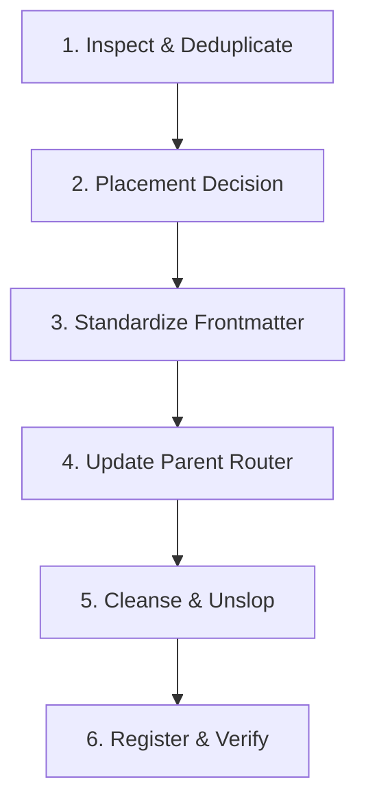

# Skill Curator

Automated workflow for ingesting, categorizing, standardizing, and wiring new or existing skills into the Takomi Skills Ecosystem without prompt bloat.

---

## 1. The 6-Step Ingestion Workflow

When the user gives you a new skill (or asks to organize, rename, or import one), execute these 6 steps in order:



---

### Step 1: Inspect & Deduplicate
1. Read the incoming skill's instructions, code, and helper scripts.
2. Search existing suites (`assets/.agent/skills/`) to check for duplicate or overlapping capabilities:
   ```bash
   node scripts/verify_skills_integrity.cjs
   ```
3. If an existing skill already handles this domain, present a recommendation to the user to either **merge**, **upgrade**, or **co-locate** the skill.

---

### Step 2: Placement Decision
Apply the **Lean Unified Skills Architecture** rules:

| Condition | Destination | Action |
| :--- | :--- | :--- |
| Relates to an existing domain (frontend, video, dev, testing, agents, docs, marketing) | **Existing Umbrella Suite** | Place as a sub-folder inside the suite (e.g. `assets/.agent/skills/<suite>/<sub-skill>/`). |
| Single-purpose CLI binary wrapper or global mode | **Standalone Skill** | Place at top level `assets/.agent/skills/<skill>/`. |
| Distinct new domain with 3+ related sub-skills | **New Umbrella Suite** | Create new suite folder with top-level router `SKILL.md`. |
| **Core Essentials** | **Reserved** | **NEVER** automatically add to Core Essentials. Core status is strictly decided by the user. |

---

### Step 3: Standardize Frontmatter & Naming
Every `SKILL.md` MUST begin with standardized YAML frontmatter:

```yaml
---
name: my-skill-name
description: Use when [user wants to do X, trigger condition Y, or intent Z]... (Max 2 sentences, dense keyword triggers).
author: Original Author
coauthored: J StaR Films / Takomi
version: 1.0.0
---
```

**Naming Standards:**
- Directory name and `name` must be lowercase `kebab-case`.
- `description` must always begin with `"Use when..."` and contain specific, highly searchable domain keywords.

---

### Step 4: Update Parent Suite Router (If Sub-Skill)
When placing a sub-skill inside an umbrella suite:
1. **Update Router Frontmatter:** Add the sub-skill's keyword triggers to the parent suite's `SKILL.md` `description` field so harnesses index it in the prompt.
2. **Update Router Table:** Add a row to the sub-skills markdown table in the parent's `SKILL.md`:
   ```markdown
   | **`sub-skill-name`** | Brief one-line purpose | [`sub-skill-name/SKILL.md`](sub-skill-name/SKILL.md) |
   ```

---

### Step 5: Cleanse, Unslop & Platform Hardening
1. **Apply Unslop Filter:** Read `.agents/skills/unslop/SKILL.md`. Remove conversational AI filler, unparsed Markdoc/HTML tags (``, ``, ``), and UI-specific button assumptions.
2. **Convert to Direct Instructions:** State what the agent should do directly and concisely.
3. **Windows UTF-8 Hardening (Python Scripts):** If the skill includes Python CLI scripts, ensure standard output handles UTF-8:
   ```python
   import sys
   if hasattr(sys.stdout, 'reconfigure'):
       sys.stdout.reconfigure(encoding='utf-8')
   if hasattr(sys.stderr, 'reconfigure'):
       sys.stderr.reconfigure(encoding='utf-8')
   ```

---

### Step 6: Register & Verify
1. **Catalog Registration:** If adding a top-level standalone skill or new suite, register it in `.pi/extensions/takomi-context-manager/skill-categories.js` under the appropriate category in `SKILL_CATEGORIES`.
2. **Run Integrity Verification:**
   ```bash
   node scripts/verify_skills_integrity.cjs
   ```
   Confirm that all relative links resolve and 0 errors are reported.
3. **Run Test Suite:**
   ```bash
   npm test
   ```
