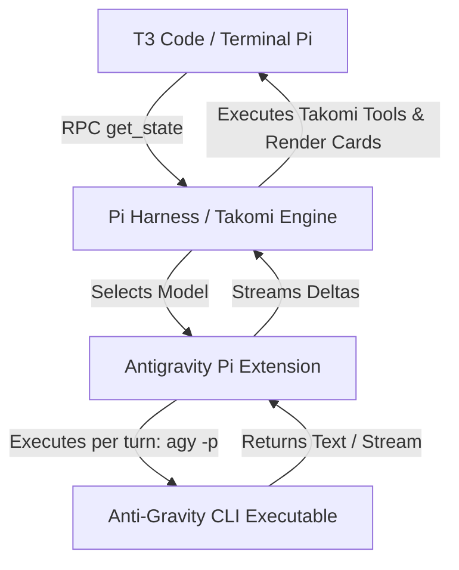

# Antigravity Pi Provider Integration

## Executive Summary

This feature spec outlines the integration of **Google Antigravity** (via the local `agy` CLI binary) into the **VibeCode Protocol Suite / Takomi** as a native **Pi Model Provider Extension** (`pi-antigravity-provider`).

By extending Pi's model provider layer rather than modifying T3 Code's server internals, Antigravity models automatically become available across all T3 surfaces (Desktop, Web, and Mobile) and terminal Pi (`pi -r`) while preserving 100% of Takomi's subagent tools, custom prompt rules, context manager, and structured UI cards out of the box.

---

## Architectural Strategy: Why a Pi Extension?



### Key Advantages:

1. **Zero T3 Code modifications:** T3 Code's `PiAdapter` queries Pi for registered models dynamically via JSON-RPC `get_state`. Once Pi registers `antigravity/...` models, T3 Code displays them instantly in composer pickers.
2. **Preserves Takomi Ecosystem:** Pi remains the outer agent harness, keeping all Takomi tools (`ask_user_question`, todo cards, subagent orchestration, VibeCode skills, context mode) active regardless of the underlying LLM backend.
3. **Seamless Multi-Surface Support:** Works identically in T3 Desktop, T3 Web, T3 Mobile, and terminal Pi.

---

## Terms of Service & Compliance Verification

| Check | Status | Verification |
| :--- | :--- | :--- |
| **Google Terms of Service** | **COMPLIANT** | The extension executes the user's locally installed, officially authenticated `agy` CLI binary on their local OS via process IPC (stdin/stdout). No private API keys are scraped, reverse-engineered, or proxied to third-party servers. |
| **Harness Ownership** | **COMPLIANT** | The user runs their own software locally. T3 Code / Pi acts purely as a local GUI and orchestration wrapper around the official CLI binary. |

---

## The "Harness-inside-Harness" Tool Boundary

Both **Pi** and **`agy`** (Anti-Gravity CLI) have built-in tool execution loops (file edits, shell execution, search). Running both tool loops simultaneously leads to double execution, file conflicts, and state desynchronization.

### Resolution:
- **`agy` runs in Pure Completion Mode:** When Pi delegates a turn to the Antigravity extension, it instructs `agy` not to execute tools locally (`Do not use tools. Return standard response text or tool calls only`).
- **Pi owns Tool Execution & Safety:** Pi receives Antigravity's text and tool call intent, performs safety checks, handles user approval, executes local file/shell operations, and formats Takomi UI cards.

---

## Session Management & Mid-Chat Model Switching

### 1. Pi is the Single Source of Truth
- Pi owns the master thread history (`.jsonl` session file), system prompts, active workspace context, and token compaction.
- The extension does **not** rely on `agy`'s internal conversation storage for thread persistence.

### 2. Stateless Turn Execution (`agy -p`)
- Each turn, Pi formats the current prompt/context delta and calls `agy -p` (print mode) with a timeout and log wrapper.
- **Mid-Chat Switching:** Because Pi owns the master thread, you can switch from Claude 3.7 to Antigravity Gemini 3.6 Flash for a complex reasoning step and back to Grok seamlessly in the **same thread** without history loss.

### 3. Server-Side Context Caching
- Google Gemini backends natively perform KV prompt caching for repeated system instructions and context prefixes across API turns.
- Stateless turn execution preserves high speed and low latency without maintaining complex client-side session files inside `agy`.

---

## Technical Blueprint: Extension Implementation

### Location in VibeCode Protocol Suite Repo:
`src/extensions/antigravity-provider/index.ts` (or `plugins/pi-antigravity-provider/`)

### Core Model Declarations:
- `antigravity/gemini-3.5-pro`
- `antigravity/gemini-3.6-flash`
- `antigravity/gemini-3.6-ultra`

### Execution Pattern:
```bash
agy -p "<formatted_prompt>" \
  --print-timeout 120s \
  --log-file "<temp_log_path>"
```

### Transcript Parser & Streaming:
- Reads the generated transcript at `C:/Users/johno/.gemini/antigravity-cli/brain/<conv_id>/.system_generated/logs/transcript.jsonl` or captures stdout.
- Yields text tokens and thinking/reasoning blocks to Pi's model provider interface.

---

## Verification & Deployment Plan

1. **Local Test:** Link extension to `C:\Users\johno\.pi\agent\extensions\antigravity-provider`.
2. **Model Discovery Test:** Launch terminal `pi` and verify `pi models` lists `antigravity/*`.
3. **T3 Code Test:** Launch T3 Code Desktop/Web and verify Antigravity models appear in the composer dropdown and stream turns cleanly.
4. **Publish & Distribution:** Bundle package as `@juicesharp/pi-antigravity-provider` for NPM distribution.

---

## Implementation Learnings & Architecture Status

### 1. Lossless File-Based Context Loading (`@[file]`)
- **Problem Solved:** Passing long prompt histories directly as CLI string flags (`agy -p "..."`) triggers Windows command-line string length limits (`cmd.exe` 8,191 chars).
- **Solution Implemented:** The extension writes the system prompt and conversation history up to the current turn into a temporary context file (`takomi_antigravity_ctx_<sessionId>.md`). It then passes `@[path_to_context.md]` to `agy -p`.
- **Result:**
  - Zero command-line string length errors (CLI argument footprint is ~100 bytes).
  - 100% loss-free context retention (no aggressive prompt truncation needed).
  - Preserves Google Gemini server-side KV prompt context caching across API turns.

### 2. Tool Calling Boundary & Harness Identity (Current Findings)
- **Experimentation:** We tested injecting JSON tool schemas into the context file to allow `agy -p` to emit structured tool-call blocks (`toolCall`) for Pi to execute.
- **Finding:** Because `agy` is an agent harness with its own built-in system prompt instructions, attempting to prompt `agy -p` to execute synthetic outer tool calls causes instruction leakage—`agy` confuses its own CLI environment with Takomi/Pi tools.
- **Current Strategy:**
  - Treat `agy` directly as a top-level harness/GUI target when complex autonomous tool loops are required.
  - Keep `antigravity-provider` in Pi as a **pure completion, reasoning, and text-generation engine** with lossless file-based context loading (`@[file]`).

